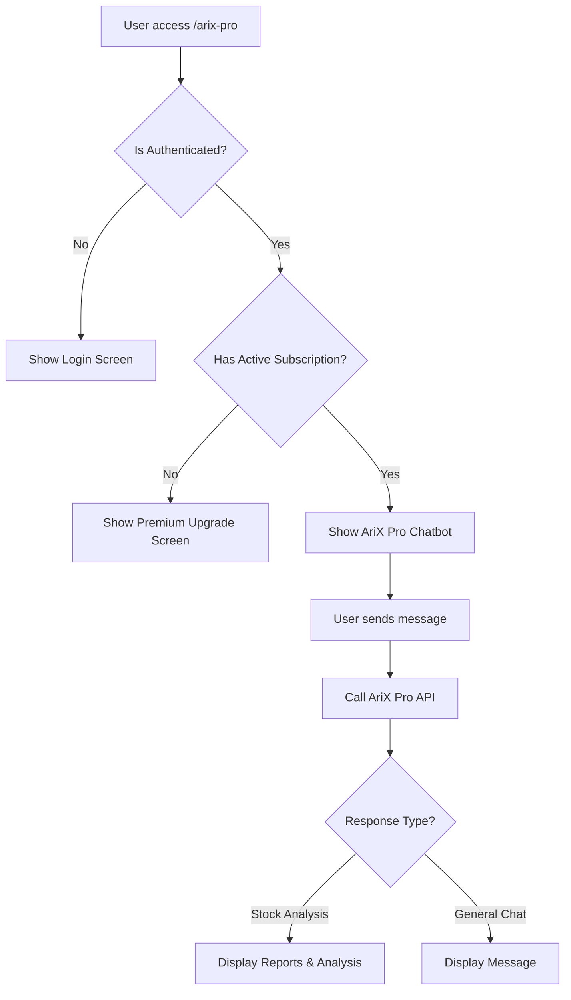

# AriX Pro - Trợ lý AI Chuyên Nghiệp

## Tổng quan

AriX Pro là phiên bản premium của chatbot AriX, được thiết kế dành riêng cho người dùng đã đăng ký gói Premium. Chatbot sử dụng mô hình AriX Pro độc quyền của IQX để phân tích cổ phiếu chuyên sâu.

## ✨ Tính năng

### 1. **Mô hình AriX Pro của IQX**
- Mô hình AI phân tích thông minh độc quyền
- Phân tích chuyên sâu và chi tiết
- Độ chính xác cao với confidence score

### 2. **Tích hợp IQX**
- Tổng hợp báo cáo từ các công ty chứng khoán hàng đầu
- Phân tích tối đa 5 báo cáo gần nhất
- Hiển thị đầy đủ thông tin: khuyến nghị, giá mục tiêu, tiềm năng tăng giá

### 3. **Lưu lịch sử chat**
- Tự động lưu tất cả cuộc hội thoại vào localStorage
- Load lại lịch sử khi quay lại
- Có thể xóa lịch sử bất cứ lúc nào
- Lưu trữ an toàn trên thiết bị người dùng

### 4. **Giao diện hiện đại, tương lai**
- Thiết kế minimalist, gọn gàng
- Glassmorphism effects (backdrop blur)
- Animation tinh tế, mượt mà
- Responsive hoàn toàn
- Dark mode support
- Typography sạch sẽ với nhiều white space
- Gradient accents tinh tế

### 5. **Kiểm soát truy cập**
- Chỉ dành cho user đã đăng nhập
- Yêu cầu subscription active
- Redirect tự động đến trang premium nếu chưa đăng ký

## 📁 Cấu trúc file

```
src/
├── types/
│   └── arix-pro.ts                    # Types cho AriX Pro
├── services/
│   └── arix-pro.service.ts            # Service call API
├── hooks/
│   └── use-arix-pro.ts                # Custom hook cho chatbot
├── components/
│   └── chatbot/
│       └── AriXProChatbot.tsx         # Component chatbot
└── pages/
    └── arix-pro.tsx                   # Page chính với subscription check
```

## 🚀 Cài đặt & Sử dụng

### 1. API Configuration

Đảm bảo AriX Pro API đang chạy tại `http://localhost:5999`

```bash
# Trong file .env (nếu cần)
VITE_ARIX_PRO_API_URL=http://localhost:5999/api
```

### 2. Truy cập

Sau khi đăng nhập và có subscription active:

- Truy cập: `http://localhost:5173/arix-pro`
- Hoặc click vào button "AriX Pro" ở header (màu tím)

### 3. Sử dụng

1. **Phân tích cổ phiếu:**
   ```
   Phân tích cổ phiếu VIC
   ```

2. **So sánh cổ phiếu:**
   ```
   So sánh VCB và TCB
   ```

3. **Câu hỏi chung:**
   ```
   Xu hướng thị trường hôm nay như thế nào?
   ```

## 🎨 Thiết kế UI - Compact Split Layout

### Design Philosophy:
- **Compact Layout**: Sidebar 380px cố định, Chat responsive
- **Feature Showcase**: Grid 2x3 gọn gàng với gradient icons
- **Glassmorphism**: Backdrop blur cho depth
- **Tight Spacing**: Padding và gap nhỏ hơn cho gọn gàng
- **Clear Hierarchy**: Features → Stats → CTA logic
- **Responsive**: Desktop 2 cột, Mobile ẩn sidebar

### Màu sắc:
- **Purple Gradient**: `from-purple-500 to-indigo-600`
- **Glassmorphism**: `bg-white/40 backdrop-blur-2xl`
- **Borders**: Ultra subtle với opacity 20%
- **Shadows**: Soft, colored shadows

### Layout Structure:
```
┌──────────────────────────────────────────┐
│  Left (380px)       │   Right (flex-1)  │
│  ──────────────────  │  ────────────────  │
│  • Logo (12px)      │  • Clear Button   │
│  • Description      │  • Chat Messages  │
│  • 6 Features       │    (compact)      │
│    (2x3 grid)       │  • Input          │
│  • Stats (3 cols)   │    (40px)         │
│  • CTA Card         │                   │
└──────────────────────────────────────────┘
```

### Left Sidebar (380px):
1. **Logo Section** - 12x12 icon compact
2. **Description** - 1 đoạn ngắn gọn
3. **Features Grid** - 2x3 cards gọn:
   - Brain (Mô hình AriX Pro)
   - BarChart3 (Real-time Data)
   - FileText (Báo cáo chuyên sâu)
   - Zap (Phản hồi nhanh - 30s)
   - Shield (Bảo mật cao)
   - Clock (Lưu lịch sử)
4. **Stats Card** - Grid 3 cột: 99%, <30s, 24/7
5. **CTA Card** - Compact với "Powered by IQX"

### Right Side - Chat:
1. **Clear Button** - 7px height, text-xs
2. **Chat Container** - rounded-2xl glassmorphism
3. **Messages** - Avatars 7px (w-7 h-7)
4. **Reports** - rounded-lg với text-[10px]
5. **Input** - 40px min-height, auto-expand đến 96px

### Typography Scale (Compact):
- **H1**: text-2xl (24px) - Logo title
- **H2**: text-sm/text-lg (14px/18px) - Section headers
- **Body**: text-sm (14px)
- **Small**: text-xs (12px)
- **Micro**: text-[11px], text-[10px], text-[9px]

### Spacing (Tight):
- **Sidebar**: w-[380px] fixed
- **Avatar**: 7x7 (w-7 h-7)
- **Gap**: gap-2, gap-2.5
- **Padding**: p-2.5, p-3, p-3.5 (compact)
- **Rounded**: rounded-lg, rounded-xl
- **Height**: h-[92vh] (taller)

### Key Features:
- **6 Compact Cards**: Grid 2x3, 9x9 icons, text-xs
- **3-Column Stats**: Text-xl numbers, text-[10px] labels
- **Compact CTA**: p-4 padding, text-sm title
- **Tight Messages**: 7x7 avatars, gap-2 spacing
- **Small Reports**: rounded-lg, text-[10px] labels
- **Compact Input**: 40px min, 96px max height

### Spacing Strategy:
- **Sidebar padding**: p-6 overall, gap-4 between sections
- **Feature cards**: p-3, gap-2.5 grid
- **Chat padding**: px-4 lg:px-5, py-5
- **Message gap**: gap-2 between avatar & content
- **Input area**: p-3 padding

### Branding:
- **No mention of GPT-5**: Chỉ "mô hình AriX Pro của IQX"
- **Powered by**: "IQX Platform" thay vì "GPT-5"
- **Features**: Nhấn mạnh "độc quyền", "chuyên sâu"
- **Description**: "mô hình AriX Pro độc quyền của IQX"

## 📊 Response Types

### Stock Analysis Response

Khi user hỏi về một cổ phiếu cụ thể:

```typescript
{
  success: true,
  type: "stock_analysis",
  ticker: "VIC",
  message: "Phân tích chi tiết...",
  reports: [
    {
      title: "VIC - Vingroup...",
      source: "VCBS",
      issueDate: "2025-01-15",
      recommend: "MUA",
      targetPrice: "45000",
      currentPrice: "42000",
      upside: "7.14%",
      content: "..."
    }
  ],
  totalReportsAnalyzed: 5,
  queryAnalysis: {
    intent: "stock_analysis",
    confidence: 0.95
  },
  usage: {
    prompt_tokens: 15234,
    completion_tokens: 1087,
    total_tokens: 16321
  }
}
```

### General Chat Response

Khi user hỏi câu hỏi chung:

```typescript
{
  success: true,
  type: "general_chat",
  message: "Thị trường chứng khoán...",
  queryAnalysis: {
    intent: "general_chat",
    confidence: 0.85
  },
  usage: {
    prompt_tokens: 120,
    completion_tokens: 85,
    total_tokens: 205
  }
}
```

## 🔒 Bảo mật & Kiểm soát

### Subscription Check

```typescript
// Trong arix-pro.tsx
const { data: subscription } = useQuery({
  queryKey: ["my-subscription"],
  queryFn: () => SubscriptionService.getMySubscription(),
  enabled: isAuthenticated,
});

const hasActiveSubscription = subscription?.status === "active";
```

### Route Protection

```typescript
// Trong main.tsx
{
  path: "arix-pro",
  element: (
    <ProtectedRoute>
      <AriXProPage />
    </ProtectedRoute>
  ),
}
```

## 🎯 Flow hoạt động



## 🛠️ Technical Stack

- **React**: UI framework
- **TypeScript**: Type safety
- **Zod**: Schema validation
- **TanStack Query**: Data fetching & caching
- **React Markdown**: Render AI response
- **Tailwind CSS**: Styling
- **Lucide React**: Icons

## 📝 API Integration

### Service Layer

```typescript
// arix-pro.service.ts
class AriXProService {
  private baseUrl = "http://localhost:5999/api";

  async chat(request: AriXProChatRequest): Promise<AriXProResponse> {
    // API call implementation
  }
}
```

### Hook Layer

```typescript
// use-arix-pro.ts
export function useAriXPro() {
  const [messages, setMessages] = useState<AriXProChatMessage[]>([]);
  const [isLoading, setIsLoading] = useState(false);

  const sendMessage = async (content: string) => {
    // Message handling
  };

  return { messages, isLoading, sendMessage, clearHistory };
}
```

## 🎨 UI Components Highlights

### Welcome Screen
- Logo animation với gradient purple
- 4 suggestion buttons với hover effects
- Typography với gradient text

### Report Cards
- Gradient background (purple/indigo shades)
- Badge với màu theo khuyến nghị
- Grid layout cho thông tin
- Line clamp cho content

### Input Area
- Focus border animation
- Gradient send button
- Character limit (500)
- Enter to send support

## 🔄 State Management

### Messages State
```typescript
interface AriXProChatMessage {
  id: string;
  content: string;
  sender: "user" | "bot";
  timestamp: Date;
  data?: AriXProResponse;
  type?: "normal" | "error";
}
```

### Loading State
- Typing indicator với bounce animation
- Disabled input khi đang loading
- Loading text: "Đang phân tích..."

## ⚡ Performance

- Lazy loading components
- Memoized callbacks
- Auto scroll optimization
- Debounced API calls (if needed)

## 🎨 Design Tokens

```css
/* Primary Colors */
--purple-gradient: from-purple-500 via-violet-500 to-indigo-600;
--purple-hover: from-purple-600 via-violet-600 to-indigo-700;

/* Shadows */
--shadow-purple: shadow-purple-500/30;
--shadow-lg: shadow-lg;
--shadow-xl: shadow-xl;

/* Animations */
--transition-all: transition-all duration-300;
--hover-scale: hover:scale-105;
```

## 📱 Responsive Design

- Mobile: Full screen chat
- Tablet: Max-width container
- Desktop: Max-width 6xl with padding

## 🚨 Error Handling

### Network Errors
```typescript
"Không thể kết nối đến AriX Pro. Vui lòng kiểm tra kết nối mạng."
```

### API Errors
```typescript
"Lỗi server. Vui lòng thử lại sau."
```

### Display
- Error messages in red card
- Dismiss option
- Retry suggestion

## 📈 Future Enhancements

1. **Streaming Response**: Real-time AI response streaming
2. **Voice Input**: Speak to ask questions
3. **Export Reports**: Download analysis as PDF
4. **Chart Integration**: Display price charts inline
5. **History Search**: Search through chat history
6. **Favorites**: Save important analyses

## 🔗 Navigation

### Header Integration
- Button "AriX Pro" với purple gradient
- Position: Before "Nâng cấp Premium"
- Icons: Sparkles + Zap
- Hover: Scale animation

### Mobile Menu
- Prominent position at top
- Same styling as desktop
- Auto-close on navigation

## 📞 Support & Contact

Nếu có vấn đề với AriX Pro:

1. Kiểm tra API đang chạy: `http://localhost:5999/api`
2. Kiểm tra subscription status
3. Clear browser cache
4. Check console logs

## 🎉 Conclusion

AriX Pro là một chatbot AI cao cấp với:
- ✅ Giao diện đẹp mắt, chuyên nghiệp
- ✅ Tính năng phân tích mạnh mẽ
- ✅ Kiểm soát truy cập chặt chẽ
- ✅ Tích hợp hoàn chỉnh với hệ thống
- ✅ UX/UI tối ưu

**Chúc bạn sử dụng hiệu quả! 🚀**

